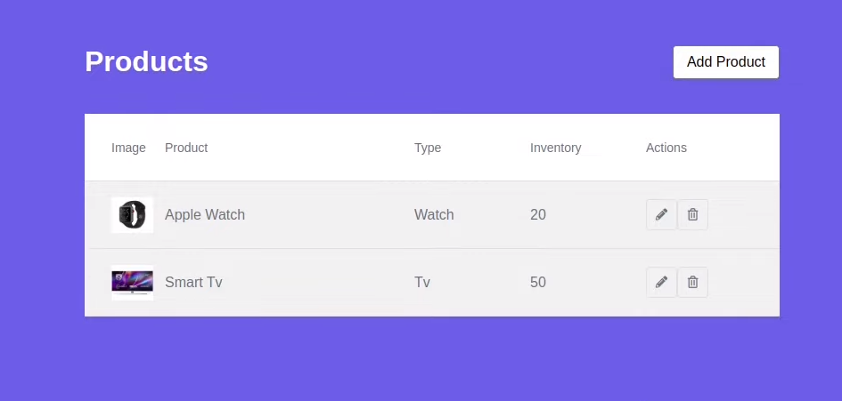
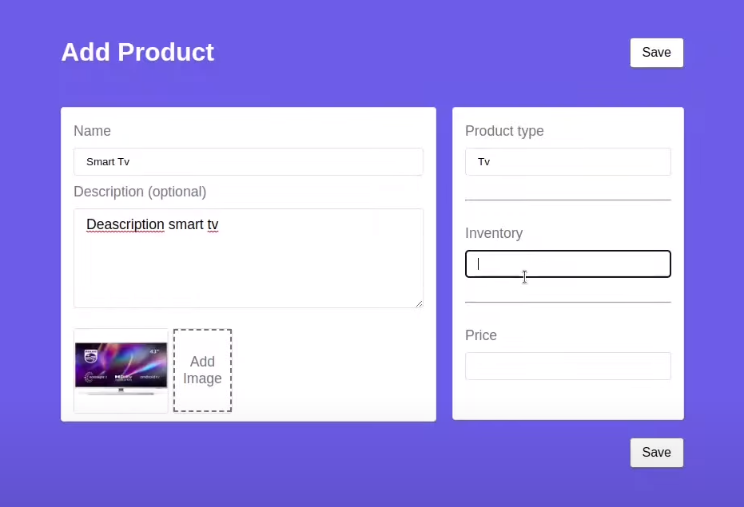
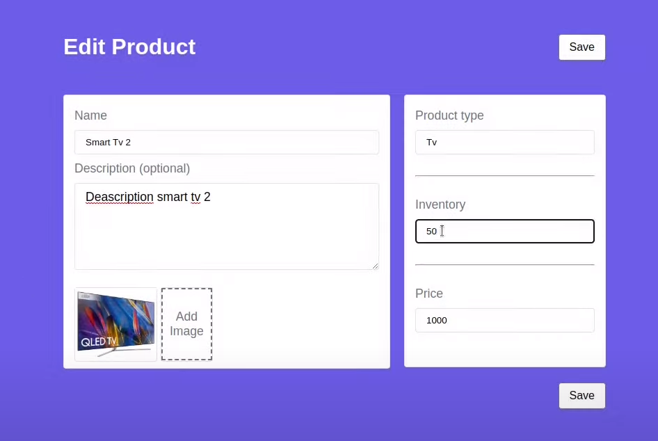

# CRUD Mini shopping

Um projeto feito para estudo pessoal! Um CRUD de uma loja construido com Laravel 9 e React. 

Com laravel foi feito a base de dados e API assim como todas as suas ligações. 

Com react foi feito todo o frontend do projeto.

Também foi utilizado no projeto:

Sweetalert2

react-route-dom

Intervention Image

## Project

### listagem de produtos

### Adicionando produtos

### Editando produtos

## License

[MIT](https://choosealicense.com/licenses/mit/)
